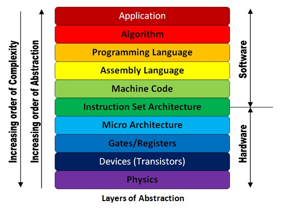

```{r setup, include=FALSE}
knitr::opts_chunk$set(echo = FALSE)
```

## Logistics
* Please do the survey if you haven't yet!
* Questions for me?

## On Datacamp
Intro to R:

  * You learnt basic data structures, including factors, lists, data frames
  
Intermediate R:

  * You learnt conditionals, loops, functions, apply, regexp and datetimes
  
ggplot2 intro, aesthetics, geometries

  * you learnt about how to plot stuff for EDA.
  
## Datacamp Check-in
  
* What did you like/what was something that surprised you? 
* What did you find frustrating?
* Favorite restaurant in NYC

## Syntax and Error 
* Syntax -- code is structured for the computer
  * Very common error -- type in code, with slight syntax problem
  * Professional programmers make that sort of "error" all the time
  * Fortunately, very easy to fix ... don't worry about it
* Not a reflection of some flaw in the programmer
  * Just the nature of typing ideas into the mechanical computer language
  * Beginners can be derailed by syntax step, thinking they are making some big error
* Try to make a bunch of typical syntax errors and fix them
* Fixing these little errors is a small, normal step 

(source: Stanford CS101)

## Apart from syntax, some of my takeaways
* It's really hard to be precise
* Data structures matter a lot 
  * They determine how data is stored
  * What you can do next with the variable depends on the data type
* Manipulating specific types of data is hard
  * regexp is like a whole new language
  * dates and times are surprisingly tricky
* Plotting seems relatively straightforward, but very different somehow.

## This week
* Quick summary of last week
* Abstraction once more
* Pseudocode
* Pseudocode breakout exercise
* Recursion
* big pseudocode-recursion exercise

## Summary of last week
* A computer just does two things
  * perform calculation
  * remember results
* A process is a *precise* sequence of steps
* Computer = Powerful + Stupid
  * Let computers do the repetitive work for you!
  * We can endow computers with some decision making power using logicals
  * But you have to be precise in doing so
* Abstraction and Recursion 

## What is the role of a programmer 
* Programmers harness the power of a computer!
* The programmer thinks up a useful feature
  * Requires creativity, insight about human needs, and knowledge of computers
* Programmers break down the steps, writing code for the computer
  * Dumbs it down for the computer!
* Best features of both sides: 
  * inexpensive/fast processing of computer + creative insight of the programmer
  
(source: Stanford CS101)

## Abstraction Definition
> Abstraction is 'the process of removing physical, spatial, or temporal details, or attributes in the study of objects of systems to focus attention on details of greater importance.  

## Abstraction Diagram


## Increasing Abstraction 

* Linear regression gives you the best fit line between an independent $x$ and dependent variable $y$
* ...that minimizes sum of squared error between predicted values and the actual dependent variables
* ...that is derived using optimization
* ...which is choosing the best value of the parameter $\beta$ subject to certain criteria
* ...the criteria is....


## Pseudocode
>  Pseudocode is the plain language description of the steps in an algorithm or another system. 

* Intended for human reading!
* You write pseudocode trying to anticipate what you'll need to do code wise to implement the algorithm in a process. 

## Pseudocode Example
> Determine whether an integer is a palindrome? Return true or false as needed.

## Pseudocode Example
```{r, echo = TRUE}
# Assume that it's stored in a numeric vector of length 1
# Convert to a character vector
# Store the length of the string in a variable
# If the length is odd
  # Find the middle indices
  # Slice and store the string up to the middle number (exclusive)
  # Slice the store the string from the middle (exclusive) to the end
# If it's even
  # find the middle two numbers
  # Slice and store the string up to the first middle number 
  # Slice the store the string from the second middle number to the end
# Reverse the second stored value
# Check whether they are the same
# If they are it's a palindrome! Return True
# Else Return False
```

## Pseudocode to real code
```{r, echo = TRUE}
# Assume that it's stored in a numeric vector of length 1
# Convert to a character vector
is_palindrome<-function(x){
  x <- as.character(x)
  # Store the length of the string in a variable
  len_string <- nchar(x[1])
  # If the length is odd
  if (len_string%%2 >0){
    # Find the middle indices
    middle <- len_string%/%2+1
    # Slice and store the string up to the middle number (exclusive)
    first_part <- substr(x,1,middle-1)
    # Slice the store the string from the middle (exclusive) to the end
    second_part <- substr(x,middle +1 ,len_string)
  } else {
    # find the middle two numbers
    middle1 <- len_string%/%2
    middle2 <- middle1+1
    # Slice and store the string up to the first middle number 
    first_part <- x[1:middle1]
    # Slice the store the string from the second middle number to the end
    second_part <- x[middle2:len_string]
  }
  # Reverse the second stored value
  second_part <- stri_reverse(second_part)
  # Check whether they are the same
  if (first_part == second_part){
  # If they are it's a palindrome! Return True
      return(T)
  } else {
  # Else Return False
      return(F)
  }
}

```


## Pseudocode breakout exercise 
* If you're watching the recording, pause now and write the pseudocode yourself.
* I want to write a function that takes in a number *n* as input.
* the function iterates from 1 until that number, printing one item for each number
* the output I want prints fizz if it's divisible by 3, buzz if it's divisible by 5, 'fizzbuzz' if both.: 

> 1
  2
  fizz
  4
  buzz
  fizz
  7
  8
  fizz
  buzz
  11
  fizz
  13
  14
  fizzbuzz
  16

## Let's save this as a script. 
* A script is just a process file
* Convention: name_of_file_that_you_choose.___
  * ___ just tells the computer or programmer what type of file it is. 
  * .R is an R Script
  * .Rmd are Rmarkdown files
  * .py is a python script
  * .html is hypertext markup language
  * .zip is a archive file format
  * .tar.gz is a tarball wrapped in a gzip compression scheme
  * portable document format are .pdf
* What type of file it is tells you what program to run the file in. 

## Recursion
> the repeated application of a recursive procedure or definition.

## Recursion
> the repeated application of a recursive procedure or definition.

> It's something that is defined in terms of itself.

## Recursion 

> Which of these is the best definition of ancestor?

* Ancestor > Parent of Ancestor
* Ancestor > Parent, Ancestor > Parent of Ancestor
* Ancestor > Parent, Ancestor > Parent of Parent, 
  Ancestor > Parent of Parent of Ancestor

## Recursion (simplest example)

What is $n\!$ for all n?

```{r, echo = TRUE}
### Recursive factorial
factorial <- function(n){
    if(n == 0){
      return(1)
    } else {
        return(n*factorial(n-1))
    }
}
```

## Recursion (last week's example)

What is the *n*th number of the Fibonacci sequence?

```{r, echo = TRUE}
fibonacci <- function(n){
  # Base case
  if ((n==1)|(n==2)){
    return(1)
  }
  # Recursive case
  else {
    return(fibonacci(n-1) + fibonacci(n-2))
  }
}
```

## Your turn 
* Write pseudocode in groups that implements is_palindrome in a recursive manner.
* We won't need to code it up. 

## Now we've covered a lot of your beginner CS class
* Compare to [Computing in Context](https://courseworks2.columbia.edu/courses/106567/assignments/syllabus)
  * numpy and mpl ~= vector + matrix operations, ggplot2
  * pandas ~= what you'll do this week
* Maybe we've gone a bit deeper than that in understanding CS concepts
  * Abstraction and Recursion which are hard!
* And we've gone much faster
  * We'll practice a lot in the coming weeks!

## What we've covered
* Intro, Intermediate R
* ggplot2 basics
* Syntax
* Abstraction (again)
* Pseudocode
* Recursion (again)

## This week on Datacamp
* data.table
* Tidyverse
* short chapters on importing data from csvs, excel files


  