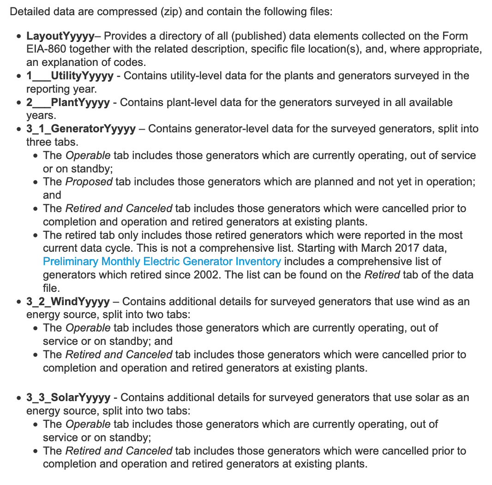

## Outline

* Go through 3a
* Simple Regressions, stargazer
* Group Q&A

## Homework

3) Since the previous dataset only had capacity for 10 years, the next step is to download data from EIA Form 860 to build capacity for a period as long as the one for emissions

(a) Follow the steps covered during recitation to build the total capacity of source for each year.

## Imports

```{r}
library(data.table)
library(readxl)
library(tidyverse)
```


## Download and unzip file

```{r echo = TRUE}
url <- "https://www.eia.gov/electricity/data/eia860/xls/eia8602019ER.zip"

data_folder <-  "data"
dir.create(file.path(".", data_folder), showWarnings = T)
fname <- file.path(data_folder, basename(url))
if (!file.exists(fname)){
  download.file(url, fname)
}
unzip(fname, exdir = data_folder)
```

## Look and examine the data


* What is the diffence between 1, 2 and 3?
* What is the difference between 2 and 3?
* Look at the data we want, is it sufficient to answer the question?
> ...build capacity for a period as long as the one for emissions

## Assumption and Algorithm

We don't need any more data. Assume:

 * All power plants in 'Operable' are still 'active' and have been active since "Operating Year"
 * All power plants in 'Retired and Cancelled' were 'active' from "Operating Year" until "Retirement Year", and that this dataset is exhaustive.
 * Power plant capacity in any given year is the total capacity of 'active' plants. 
 
## 2 methods
* Have a column with active status...
* Keep a running tally for each fuel and year. 
* What is the minimum dataset we need for each method?
  
## Join vs Concatenate?

* Concatenating (rbindlist) is stacking two datasets
* Joining (merge, join) is putting two datsets next to each other 
* Which do we want to do here?
* Which columns are important to do correctly?
```{r}

# Read in Data
fname <- file.path(data_folder, "3_1_Generator_Y2019_Early_Release.xlsx")
operable <-  as.data.table(read_excel(fname, sheet = "Operable", skip = 2, na = 'NA'))
# Look at structure
str(operable)

# Count how many nas
sum(is.na(operable$`Operating Year`))
operable[,sum(is.na(`Operating Year`))]
operable[is.na(`Operating Year`),]

# 2nd Sheet
retired <-  as.data.table(read_excel(fname, sheet = "Retired and Canceled", skip = 2, na = 'NA'))
str(retired)
retired[,sum(is.na(`Operating Year`))]
retired[,sum(is.na(`Retirement Year`))]

# Try binding
df <-  rbindlist(list(operable, retired), use.names = T, fill =  T, idcol = T)
df[,sum(is.na(`Operating Year`))]
df[,sum(is.na(`Retirement Year`))]
df<- df[!is.na(`Operating Year`)]
str(df)
```

## Get the right data types

```{r echo=TRUE}
# Convert all columns which are labelled with 'Plant Code', has 'MW', 'Year', or 'Month' to numeric data type.
num_cols <-  colnames(df)[grep("MW|Plant Code|Year|Month|Factor|Buoys", colnames(df), ignore.case=T)]
# Trick I showed last class to apply something over a bunch of columns. See the alternative there if you don't understand this
df[, (num_cols):= lapply(.SD, as.numeric), .SDcols = num_cols]
```

## Change the column names for easy access
```{r}
colnames(df)
df[,upyear := `Operating Year`]
df[,downyear := `Retirement Year`]
df[,capacity :=`Nameplate Capacity (MW)`]
```


## Get a sum of new and retiring capacity year on year (new variable) by technology
```{r}
setkey(df, upyear, Technology)
add <- df[!is.na(upyear),.(year = upyear,capacity_additions = sum(capacity,na.rm = T)), by = .(upyear, Technology)]
subtract <-  df[!is.na(downyear),.(year = downyear,capacity_subtractions = sum(capacity,na.rm = T)), by = .(downyear, Technology)]
add
subtract
```

# Join the additions and subtractions
```{r}
## Set keys
setkey(add, year, Technology)
setkey(subtract, year, Technology)

## Use expand_grid to make sure that there's a key for every year
## (this is easy to overlook until you plot)
cap <- as.data.table(expand_grid('year' = min(add[,year]):max(add[,year]), 'Technology' = unique(add[,Technology])))
setkey(cap, year, Technology)

## Check the top
head(cap)

## Sense check
add <- add[upyear !=0]

## Use expand_grid to make sure that there's a key for every year
## (this is easy to overlook until you plot)
cap <- as.data.table(expand_grid('year' = min(add[,year]):max(add[,year]), 'Technology' = unique(add[,Technology])))
setkey(cap, year, Technology)

## now merge in the additions and subtractions
cap <-  merge(cap,merge(add, subtract, all = TRUE),all.x = TRUE)
head(cap)
```

```{r}
## If there were no additions or subtractions in a year of a technology, set to 0.
cap[is.na(capacity_additions), capacity_additions:= 0]
cap[is.na(capacity_subtractions), capacity_subtractions:= 0]
# Calculate the net capacity change and the cumulative build of generating capacity
cap_final <- cap[,.(net_capacity_change = capacity_additions-capacity_subtractions), by = key(cap)]
cap_final[, capacity := cumsum(net_capacity_change), by = Technology]
```

```{r}
# Change tech also to a factor
cap_final[,Technology:= as.factor(Technology)]
# Change data types to factors then reset key
cap_final
```

```{r}
output_folder <- '.'
# Unaggregated Technology stacked area chart
ggplot(cap_final, aes(x = year, y= capacity, fill = Technology)) +
  geom_area(position = 'stack') +
  theme(legend.text = element_text(size = 8)) +
  guides(fill = guide_legend(ncol = 1)) +
  ylab("Nameplate Capacity (MW)") +
  ggtitle("United States Electricity Generation Capacity by Technology and Year", subtitle = "source: EIA-860 data")
  # scale_fill_manual(values = colors)
ggsave(file.path(output_folder, 'stacked_capacity_all.pdf'), width = 16, height = 9)

# Unaggregated Technology stacked area chart as a proportion of total capacity
ggplot(cap_final, aes(x = year, y= capacity, fill = Technology)) +
  geom_area(position = 'fill') +
  theme(legend.text = element_text(size = 8)) +
  guides(fill = guide_legend(ncol = 1)) +
  ylab("Nameplate Capacity (% of total)") +
  ggtitle("United States Electricity Generation Capacity by Technology and Year", subtitle = "source: EIA-860 data")
  # scale_fill_manual(values = colors) +
ggsave(file.path(output_folder, 'proportion_capacity_all.pdf'), width = 16, height = 9)
```

