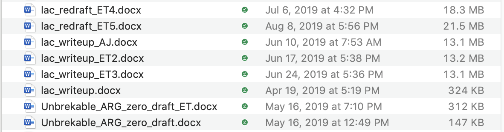
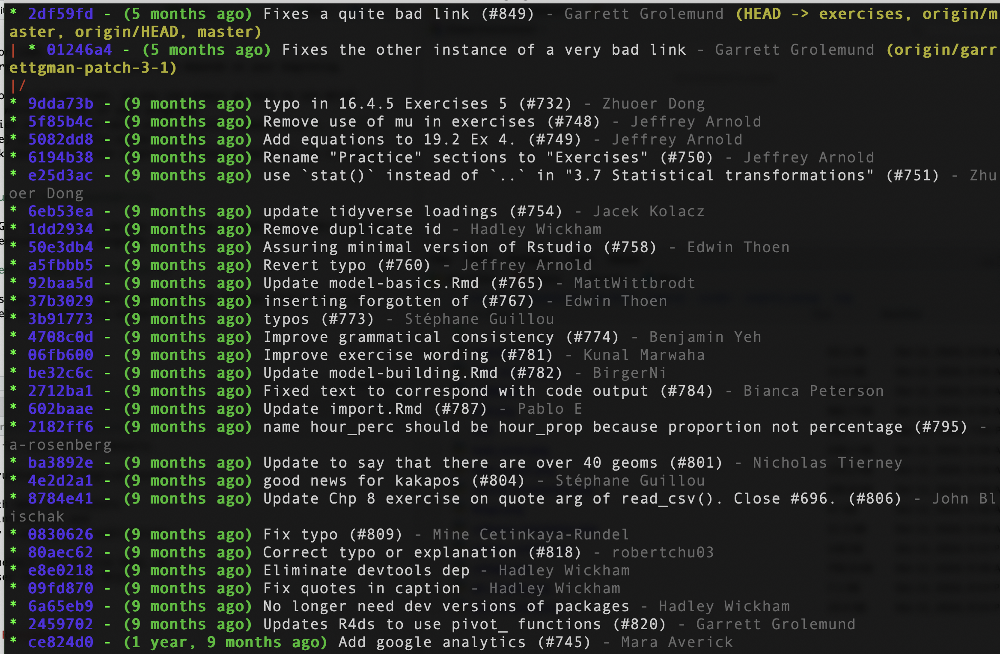
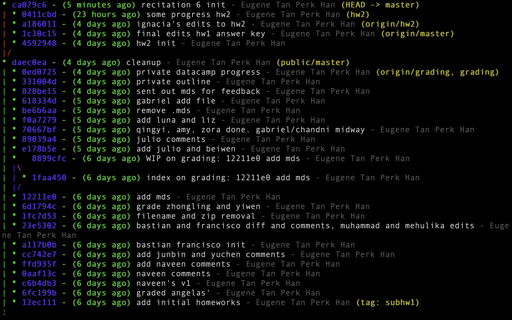
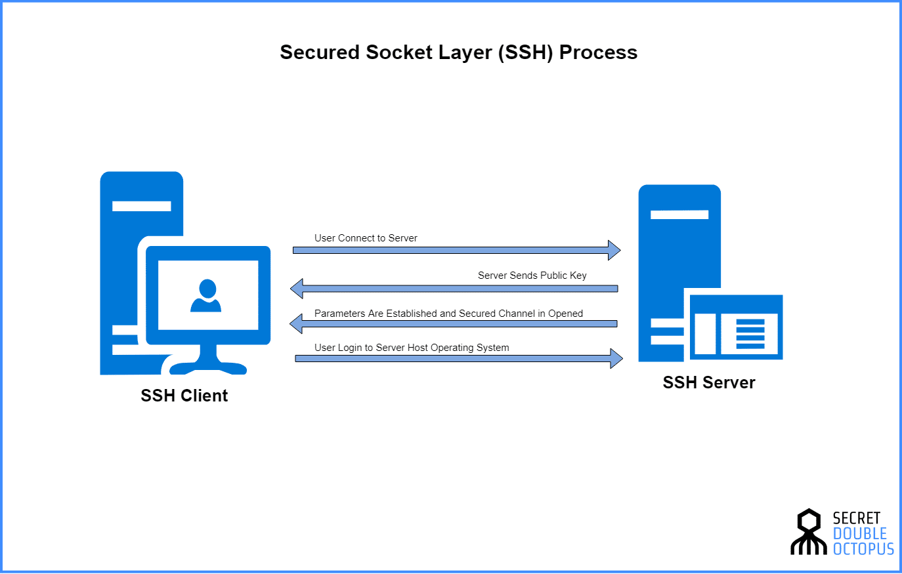
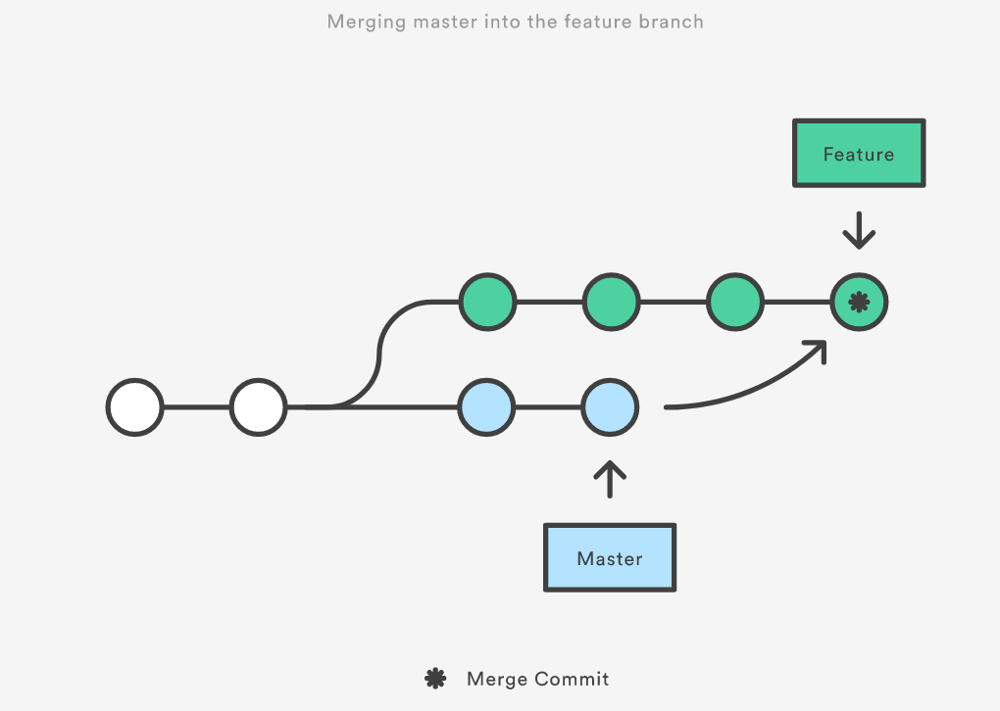
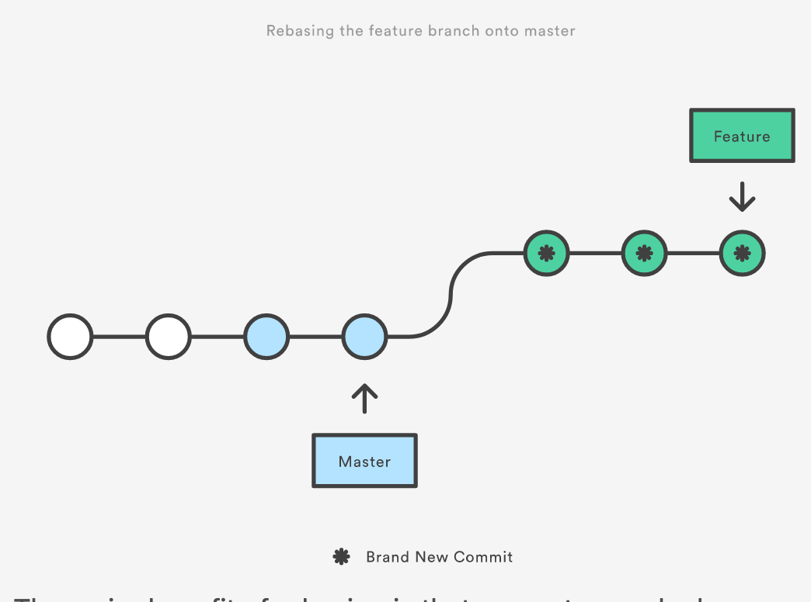

## Outline for today
* Version Control
* Git commits as snapshots
* A sequence of commits as version history
* Repositories
* Collaborating on github
* Troubleshooting - commits at the same time
  * merging
  * rebasing
  
## Version Control

* Emailing your file back and forth
* Working over zoom
* Time difference

## Version Control

Git solves this problem for code.
Code is different from normal writing because your end depends on your beginning.
Uses multiple files. 

From datacamp:
  
* Nothing that is saved to Git is ever lost, so you can always go back to see which results were generated by which versions of your programs.
* Git automatically notifies you when your work conflicts with someone else's, so it's harder (but not impossible) to accidentally overwrite work.
* Git can synchronize work done by different people on different machines, so it scales as your team does.

## Version Control - production and accountability

Nothing that is saved to Git is ever lost, so you can always go back to see which results were generated by which versions of your programs.

## Version Control - preventing bugs in collaboration

Git automatically notifies you when your work conflicts with someone else's, so it's harder (but not impossible) to accidentally overwrite work.

## Version Control - encourage collaboration on code

Git can synchronize work done by different people on different machines, so it scales as your team does.

## Version Control - preventing bugs in collaboration

## What my git repo looks like for this class

The *repository* is the folder in which everything is tracked
A *commit* is a snapshot 
[Public repo](https://github.com/taneugene/empirics_energy)
[Private repo](https://github.com/taneugene/empirics_energy_private)

## Github

Github is just a place to store your git repos online. Allows collaboration. 

## Baby command-line tools
On git bash (windows) or on terminal (mac)
`computer_name:folder username$`

* ls (-a, -l) 
* pwd
* cd (., .., ~, -)
* mkdir/rmdir
* open (-a)
* tab-autocomplete
* man
* control-a control-e

## A commit is a snapshot.

`git add` to stage a commit.
`git commit` to commit the staged items.

## Demonstration. 

Edit this file in this foldr. 

* Diff
* Add
* Complete

## Diff 

What is the difference between the status now and the last commit?

## Basic workflow

* Configure your name and email
* Configure security
* Create a git repository `git init` or `git clone`
* After you've made changes
  * Stage your changes `git add`
  * Commit a change `git commit`
  * Push your commits to GitHub `git push`
* After someone in your team has made changes
  * Get their commits from github `git pull`
  * Check what the differences they made are `git diff`
  * Work on it yourself

## Configure your git identity

Set your username
`$ git config --global user.name "John Doe"`

Set your email
`$ git config --global user.email johndoe@example.com`

Configure others
`$ git config --global init.defaultBranch main`
`$ git config --list`

## Cryptography (Setup is advanced)
If you don't want to enter your github password every time, then set a key using [this link](https://docs.github.com/en/free-pro-team@latest/github/using-git/caching-your-github-credentials-in-git)

* One-way security
* You hold a private key that is linked to a public key

## Demonstration

* Volunteer will make a private repository on github called 'ee2'.
* Share it with me and her group member.
* Clone it to her folder for this class.
* Adds the first part of her homework ee2. Commit and push. 
* I will clone it.
* Make an edit, add, commit, push.
* Liz will pull the changes, diff to see what I have done, and then continue working.

## Now we'll cause an error

What happens if we make a change at the same time?

* She will make an edit to the file and commit
* She will push
* I will make an edit to the file and commit 
* I will try to push

What is the problem here?

## Dealing with conflicts
Easy way

* look at my file and her file and manually sort out the diferences, commit that
Intermediate way

* Merge branches

Advanced way
* Rebasing

## Branches (Intermediate)

