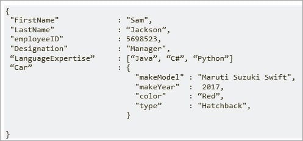
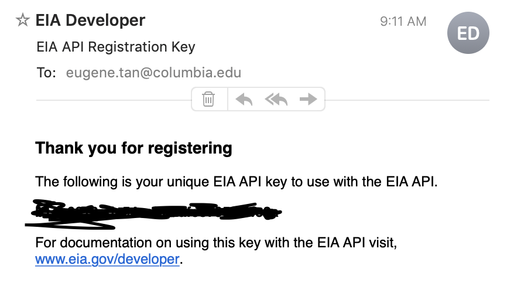

## Logistics
* Second to last class
* In our last class
  * Go over PS4?
  * Do some review of empirical methods for the exam.

## Some comments on the last homework

* Read the question please and answer all questions, not just the programming ones!
* Make sure you understand the regression before running it.
* "The coefficient is x and the SE is y" is not sufficient interpretation of results.
* Please "Restart R and Run All chunks" and check that your code works from top to bottom - this is a 1 button equivalent to proofreading an essay!
* More professional - submit 2 files
  * a *Knit* finished product (pdf or html)
  * code in .Rmd
  
## PS4 

* After class office hours
* Email me or OH for help
* Most of the points for written answers rather than code.
* Easier, no new concepts 
  * Consider doing the code alone if you have been leaning on your partner!
  * No special help I'm giving in recitation

## Today

Two ways to get data from the Internet. 

* APIs 
* Web Scraping

### Python vs R for getting data.
R is better at things that a statistician would do:

  * graphing
  * regressions 
  * out-of-the-box statistical functions
  
Python is better at 'upstream stuff':

  * data scraping
  * API calls
  * dictionary management
  * Machine Learning

I generally use python for everything upstream, and if theres some complicated analysis I'd like to do (e.g. fixed effects with robust standard errors), then I might switch into R after I've cleaned my dataset. 

### APIs

APIs are "Application Programming Interfaces". An API is computing interface that defines interactions between multiple software intermediaries. It defines the kinds of calls or requests that can be made, how to make them, the data formats that should be used, the conventions to follow, etc. (wikipedia)

* Defines interactions between me and a data provider. 
  * What kind of information can I get from your website (public/private)
  * How do I get that data?
  * What formats the data can come in.  
  
A 'Data Engineer's job  in tech is basically to organize data then define APIs for their company to use. 

#### Examples of APIs

Data Sources (Use APIs to get data):

* [EIA](https://www.eia.gov/opendata/)
* [NOAA:NCEI](https://www.ncdc.noaa.gov/cdo-web/webservices/v2)
* [National Weather Service](https://www.weather.gov/documentation/services-web-api)
* [World Bank Indicators](https://datahelpdesk.worldbank.org/knowledgebase/articles/889392-about-the-indicators-api-documentation)
* [Google Maps](https://developers.google.com/maps/documentation)
* [Planet(\$)](https://www.planet.com/products/monitoring/)
* [New York MTA](https://new.mta.info/developers)

Tech companies (Use APIs to tweet/gram/trade):

* [Twitter](https://developer.twitter.com/en/docs/twitter-api)
* [Instagram](https://developers.facebook.com/docs/instagram-api/)
* [Facebook](https://developers.facebook.com/)
* [Robinhood](https://algotrading101.com/learn/robinhood-api-guide/)

#### JSON data Structure 
```{r warning = F}
library(data.table)
library(jsonlite)
```

jsonlite: Convert R objects to/from JSON
(Javascript Object Notation)

JSON files:


#### API Key

You will need to register for an API key at the website: [https://www.eia.gov/opendata/register.php](https://www.eia.gov/opendata/register.php).
This allows the website to:

  * Associate your calls to the database with an email
  * Limit stuff you can do (e.g. 200 downloads a second)
  * Provide an identity map (contact details (e.g. bots on Twitter)).
  


##### What to do with the key

Save the key as a text file but do not share it with anyone else! It is associated with your email address.  I stored mine as "eia_key.txt"

The email for my API key arrived in my spam folder, so you might need to look for it there. 

```{r}
mykey <- read.delim("../eia_key.txt", header = FALSE)$V1
# Length 32 string of letters and numbers
print(nchar(mykey))
# Number of possible keys
(26+10)**32
```

#### Use the key to query the EIA database

We can browse the queries available on the EIA website [here](https://www.eia.gov/opendata/qb.php).

Two types of queries:

Category 

> "http://api.eia.gov/category/?api_key=YOUR_API_KEY_HERE&category_id=371"

Data

> http://api.eia.gov/series/?api_key=YOUR_API_KEY_HERE&series_id=EMISS.CO2-TOTV-RC-TO-CO.A. 

Most APIs/database calls look like this:

* http:// - internet protocol
* api.eia.gov - website
* series/category - data/category
* ?api_key - the api_key 'column' of the database
* =query - criteria 
* & - string more than one database query together
* category_id=371 - unique id for this category
* series_id=EMISS.CO2-TOTV-RC-TO-CO.A - unique id for the row of data it is. 

#### Getting data with an API Query

We will want a robust way to replace "YOUR_API_KEY_HERE" with the key that you have gotten from the EIA's website, so I use the sub function (covered in regular expressions class).

The data returned on MOST Apis are in a format called JSON. These are a very commonly used data structure that are like Python dictionaries, however there is no analogue in R. 

```{r}
test <- "http://api.eia.gov/series/?api_key=YOUR_API_KEY_HERE&series_id=EMISS.CO2-TOTV-RC-TO-CO.A"
test2 <- "http://api.eia.gov/series/?api_key=YOUR_API_KEY_HERE&series_id=ELEC.GEN.ALL-CO-99.Q"

# sub YOUR_API_KEY_HERE with your key that you've loaded. 
call_key <- function(call){
  sub("YOUR_API_KEY_HERE",mykey, call)
}

# Convert the data to jsonlite::fromJSON
json <- fromJSON(call_key(test))
json <- fromJSON(call_key(test2))
# Get the data structure
print(str(json))
# Get the data
dt <- as.data.table(json$series$data)
# Rename the columns..
setnames(dt,c('year',json$series$name))
dt
```

#### Big picture - Automate

We know how to get one piece of data. 

**Game** - make many queries of the EIA website and return it in a data frame that makes the most sense for our analysis.  

Let's say I want all the day-ahead demand forecasts that I want to use as input data for a trading platform. 

https://www.eia.gov/opendata/qb.php?category=2122627 

* category (area) 
* category (tz) 
* data series

```{r echo = TRUE}
# Downloading this data manually
52*2*2
```

I don't want to click on every single balancing authority/UTC just to get the call. 

#### Explore a category API call.

```{r}
url <- "http://api.eia.gov/category/?api_key=YOUR_API_KEY_HERE&category_id=2122627"
json <- fromJSON(call_key(url)) # Balancing authorities
print(str(json)) # This shows the structure, the relevant data is in json$category$childcategories
ba <- json$category$childcategories
ba <- as.data.table(ba)
ba
```


#### EIA API Pseudocode 

From the above dataframe, we can generate new API calls in the same format. 
Here's pseudocode for what I'm planning to do.

1. filter the data to just the balancing_authorities
2. generate a new url that I will want to call (like clicking on each link as a tab)
3. download the json for the utc/time zone page
4. filter/selecting the UTC dataset from the list of two
5. generate the URL of the data series. 
6. downloading all the series data

Notice this is a repetitive process! I filter the dataset, generate urls, download the information at those urls, then repeating that. 


```{r}

# Filter the ba data
ba <- ba[3389866 <= category_id]
# Generate the URL
ba[, url := paste0("http://api.eia.gov/category/?api_key=YOUR_API_KEY_HERE&category_id=",category_id)]
# Download the json for each page

# This gets me the json for the first page
json <- fromJSON(call_key(ba[1,url]))
print(str(json))
# Now get the childseries
dt <- as.data.table(json$category$childseries)
print(dt)
# Now get the first seriesname for the UTC data.
dt[1,series_id]

```

#### EIA API function - BA2Series
```{r}
ba2series <- function(url){
  # This gets me the json for the first page
  json <- fromJSON(call_key(url))
  # Now get the childseries
  dt <- as.data.table(json$category$childseries)
  # Now return the first seriesname for the UTC data.
  dt[1,series_id]
}

# Test
ba[5]
ba[5,ba2series(url)]

#ba[i,series_id := ba2series(url)]
# fromJSON doesn't work in a vectorized way, so loop over the rows of dt to apply this function. 
for (i in 1:nrow(ba)){
  ba[i, series_id :=ba[i,ba2series(url)]]
}

ba
```

#### EIA API function - Series2Data
1. Generate urls for each of the series
2. Make the call. 
3. Get the relevant data out and formatted. 

```{r}
# Generate the urls for each of the series. 
ba[, url_series := paste0("http://api.eia.gov/series/?api_key=YOUR_API_KEY_HERE&series_id=",series_id)]
head(ba[, url_series])

# Take the first one to explore its data structure.
url <- ba[1, url_series]
result <- fromJSON(call_key(url))
str(result)
dt <- as.data.table(result$series$data)
setnames(dt, c("Timestamp","Demand Forecast"))
dt[,name := result$series$name]
dt[,units := result$series$units]
dt[,series_id := result$series$series_id]
dt
# Put all of the above into a function 
get_data <- function(url){
  result <- fromJSON(call_key(url))
  dt <- as.data.table(result$series$data)
  setnames(dt, c("Timestamp","Demand Forecast"))
  dt[,name := result$series$name]
  dt[,units := result$series$units]
  dt[,series_id := result$series$series_id]
  dt
}
```

```{r echo =T}
# Initialize an empty vector with the right length (I don't really want to deal with the ba table any more)
demand_forecasts <- vector("list", nrow(ba))
# Now loop over the series ids and run the function on it
for (i in 1:nrow(ba)){
  url <- ba[i,url_series]
  # print(paste0('scraping ',url))
  # use the get data function
  dt <- get_data(url)
  # The only valuable information in ba is the stripped name
  name_ba <- ba[i,name]
  # Add it as a column
  dt[,balancing_authority := name_ba]
  # Assign it to the respective position in the vector. 
  demand_forecasts[[i]] <- dt
}

# Bind them all together
dt<- rbindlist(demand_forecasts)
```

#### Now explore and clean your dataset like normal!

```{r}
# Check we got all the data
dt[,unique(balancing_authority)]
# check everything is the same units
dt[,unique(units)]
tail(dt)
# I could now create a panel data set, for example
panel <- dcast(dt, Timestamp ~ balancing_authority, value.var = "Demand Forecast")
library(ggplot2)
ggplot(dt, aes(x = Timestamp, y = `Demand Forecast`, by = name )) +
  geom_line()
```

### Scraping

"Scraping": how to get unstructured data and turn it into something usable. We'll primarily focus on _web scraping_.

The basic workflow is:

1. Find the data you want on the web.
2. Inspect the webpage and figure out how to select the content you want. This usually involves some combination of
    - Viewing the source code of the page (especially if it is simple), and
    - Figuring out the structure of the HTML parse tree.  This step is much easier with familiarity of __Chrome Developer Tools__ or Firefox Inspect Element.
3.  Write code to get out what you want:
    - If the page is very simple, treat it as a bunch of text => Use grep and similar functions to get the data you want
    - If the page is more complicated (and/or written in good style), we want to use the HTML parse tree => rvest in R. (BeautifulSoup in Python)
4.  Make sure it worked!
5.  If your crawling problem is at all non-trivial, you will now have to go back to Step 2 to zoom in further -- or you'll have parsed the URL of a link you want to follow, in which case you'll go back to Step 1 to figure out how to parse what you want from the new target page.

#### the RVest package

```{r warning = FALSE}
# install.packages("rvest")
library(rvest)
```

#### Example: MIT patents

As an example, suppose we want to crawl the list of "Available Technologies" being licensed by MIT at http://tlo.mit.edu (explore and view technologies) and store their basic info; their associated patents; and the reference counts on their associated patents.

#### Step 1: Okay, let's go to that URL.

1. Figure out how the data is stored. Let's try doing a search. 
2. Try not searching. Scrolling through pages. Hit last
3. We now know that there are 84 pages and you can get to each page *n* from 0 to 83 found at `paste0('http://tlo.mit.edu/technologies?search_api_views_fulltext=&page=',n)`

```{r}
urls <- paste0('http://tlo.mit.edu/technologies?search_api_views_fulltext=&page=',0:82)
head(urls,12)
```

#### Step 2: Download all the listing pages

The problem is that connecting to a remote server and fetching the pages takes a while. Scraping web pages is usually _IO-bound_ and not CPU-bound (that is, we spent most of our time waiting for data and not processing it). ~~Fortunately, Python gives us lots of different ways to deal with this problem.~~

R does not give you a lot of ways to deal with this problem. I just hope it works below.

```{r echo = T, results = 'hide'}
# CRAN page https://cran.r-project.org/web/packages/httr/index.html 
# HTTR documentation https://cran.r-project.org/web/packages/httr/vignettes/quickstart.html

result <- read_html(urls[[1]])

download_htmls <- function(urls){
  htmls <- vector("list", length(urls))
  for (i in 1:length(urls)){
    print(paste0('scraping ',urls[[i]]))
    htmls[[i]] <- read_html(urls[[i]])
  }
  htmls
}

htmls <- download_htmls(urls)
```

#### Step 3: Figure out how to extract information from the html

##### A quick introduction to HTML and the Document Object Model (DOM)**

We are basically going to build our own API.

To get started:

- Pull up http://tlo.mit.edu/technologies?search_api_views_fulltext=&page=1 in Chrome or Firefox.  
- Right click on one of the technology titles, and choose __"Inspect Element"__.

What are we looking at?  Well.. this is the structure of the webpage.  Nested _tags_ of different _types_ and having a variety of _attributes_.

What we learned above:

  - All of the technologies are underneath ("_descendents of_")   `<section class="block block-system clearfix" id="block-system-main">`
  - In fact, each of them is in its own `<div class="views-row views-row-1 views-row-odd views-row-first"` 
          
Now, we need to parse the raw HTML and actually grab the links of detailed info. ~~The two main parser libraries in Python are `BeautifulSoup` and `lxml`. `lxml` is much faster (it leverages several C libraries), but it's also worse at dealing with malformed, crummy HTML. Because parsing speed isn't our bottleneck here, we'll use `BeautifulSoup`.~~ An R version of BeautifulSoup is called rvest, which we are already using to download our htmls.

```{r}
result %>% 
  html_node("section#block-system-main")
```

```{r}
result %>% 
  html_node("section#block-system-main") %>%
  html_node("div.views-row")
```

```{r}
result %>% 
  html_node("section#block-system-main") %>%
  html_node("div.views-row") %>%
  html_node("a")
```


##### Introduction to CSS selectors

This pattern of nested finds, based on tag type, id, and class is very common. It's so common that there are two a special convenience language for such traversals: [CSS selectors](http://www.w3schools.com/cssref/css_selectors.asp) and [XPath](http://www.w3schools.com/xpath/) (which works for all XML, not just HTML). We'll be using CSS selectors, which are more common for HTML and easier to learn.

With CSS selectors, we can write the above in a more concise and expressive way:
    ```
    divs <- html_nodes(html, 'section#block-system-main div.views-row a')
    ```
    
All selectors work like 'find_all'.  Some basic building examples of selectors are:

 - `'mytag'` picks out all tags of type `mytag`.
 - `'#myid'` picks out all tags whose _id_ is equal to `myid`
 - `'.myclass'` picks out all tags whose _class_ is equal to `myclass`
 - `'mytag#myid'` will pick all tags of type `mytag` **and** `id` equal to `myid` (analogously for `'mytag.myclass'`)
 - If `'selector1'` and `'selector2'` are two selectors, then there is another selector `'selector1 selector2'`.  It picks out all tags satisfying `selector2` that are __descendents__(*) of something satisfying `selector1`, i.e., it's like our nested find.
 
 (*) It doesn't have to be a _direct_ descedent.  I.e., it can be a grand-grand-..-grand-child of something satisfying `selector1`.  For direct descendents we'd instead write `'selector1 > selector2'`
 
Let's just explain how this applies to our example:

1.  Let's start with the first half

        > divs <- html_nodes(html, 'section#block-system-main div.views-row a')
        >                           ^^^^^^^^^^^^^^^^^^^^^^^^^
This picks out all 'section' tags with id 'block-system-main'.
2.  Then the second half

        >    divs <- html_nodes(html, 'section#block-system-main div.views-row a')
        >                                                         ^^^^^^^^^^^^
This picks out all 'div' tags with class 'views-row'.
3.  Finally the whole thing

        >    divs <- html_nodes(html, 'section#block-system-main div.views-row a')
        >                             ^^^^^^^^^^^^^^^^^^^^^^^^^^^^^^^^^^^^^^^^^
does exactly the same as our nested find above!

Let's check out what we've zoomed in to.

Now we're ready to pull out some key pieces of info:

- The technology's "title" (the text in the `<a>` element)
- The link to follow for more info on the technology (the _href_ attribute of the `<a>`)
- And sometimes a short blurb about the text (in the `<span>`)

Let's write some code to extract the url and the title.  But before we do, let's discuss what _form_ the output should take: It is often convenient to store data in a dictionary (i.e. as a _key-value_ hashtable), in other words to name the bits of data you are collecting.  One big advantage is that this makes it easier to add in extra fields progrssively.


```{r}
# Try extracting all the technology links using different page numbers
html <- htmls[[1]]

# This gives me the relevant htmls for each div
divs <- html_nodes(html, 'section#block-system-main div.views-row a')
links <- html_attr(divs, "href")

# Alternatively, use magrittr style pipes 
links <- html_nodes(html, 'section#block-system-main div.views-row a') %>% 
  html_attr("href")
links
```

#### Step 4: Get all the patents titles and urls. 

This was a semi-structured database, and we can apply what we learnt about the 1 page to all 83 of the pages that we were donloading in requests-futures. So we wrap all of the above into a function and apply it each of the htmls. 

Then we have a list of hundreds of patents along with their url. Then we can 'crawl' to the next step and download all  of those pages, and then get all the relevant information again.

```{r}
links <- vector("list", length(urls))
for (i in 1:length(htmls)){
  html <- htmls[[i]]
  links[[i]] <- html_nodes(html, 'section#block-system-main div.views-row a') %>% 
    html_attr("href")
}

# Show the structure before reducing it
print(tail(links))
```

```{r}
# Reduce the links using the c function
links <- Reduce(c,links)

# Now add the base url
base <- "http://tlo.mit.edu"
links <- paste0(base, links)

head(links)
```

#### Step 5: Download all the patent pages

Now we have all of the urls for all of MIT's Patents! Let's go one step further and go to each of their 800+  individual pages.

```{r echo = T, results = 'hide'}
# This might take a while...
htmls <- download_htmls(links[400:500])
tail(htmls)
```

#### Step 6: Extract information on patent pages you want to store

Repeat the process that we looked at in Step 3 to the patent pages? What data might be useful to store? What do we want?

```{r}
# Remember the URL
links[[2]]
html <- htmls[[2]]

# Get the Name of the Patent
name <- function(html){
  html %>%
    html_nodes('h1#page-title') %>%
    html_text
}

# Get the technology number
number <- function(html){
  html %>% 
    html_nodes("section#block-fieldblock-node-technology-default-field-technology-number div.field-item") %>%
    html_text
}

# Get a list or vector of the authors and their websites
authors <- function(html){
 html %>%
  html_nodes("div.field-name-field-inventors div.field-item h2 a") %>%
  html_text
}

# Now merge them into a data.table
dt <- as.data.table(links[400:500])
setnames(dt, 'url')
for (i in 1:nrow(dt)){
  html <- htmls[[i]]
  dt[i,patent_name := name(html)]
  dt[i,patent_number := number(html)]
  dt[i,authors := list(authors(html))]
}

head(dt)

# Exercises
# Can you get links to all of the images in the image gallery?
# Can you download the actual pdf of the patent?
# Can you get a list of related patents (Patents by the same authors)?
```


